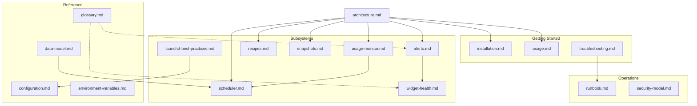

# Documentation Index

> **For AI agents:** Start with [`MANIFEST.json`](./MANIFEST.json) for machine-readable metadata, then use [`READING_ORDER.md`](./READING_ORDER.md) for task-specific reading paths.

## Quick Start Router

**What are you trying to do?**

| Goal | Start here |
|------|-----------|
| 🎓 First time here — guided walkthrough | [`tutorials/first-run.md`](./tutorials/first-run.md) |
| 🧠 Understand how it all fits together | [`concepts/mental-model.md`](./concepts/mental-model.md) |
| 🍳 Copy-paste task recipes | [`examples/cookbook.md`](./examples/cookbook.md) |
| 🚀 Install eco-commander | [`getting-started/installation.md`](./getting-started/installation.md) |
| 🧰 Use a dev container | [`../.devcontainer/README.md`](../.devcontainer/README.md) |
| 🔧 Run a command | [`getting-started/usage.md`](./getting-started/usage.md) |
| 🐛 Something is broken | [`getting-started/troubleshooting.md`](./getting-started/troubleshooting.md) → [`operations/runbook.md`](./operations/runbook.md) |
| 🏗️ Understand the architecture | [`architecture.md`](./architecture.md) |
| 📊 Debug the usage poller | [`subsystems/usage-monitor.md`](./subsystems/usage-monitor.md) |
| ⏱️ Debug the job scheduler | [`subsystems/scheduler.md`](./subsystems/scheduler.md) |
| 🔔 Investigate alerts | [`subsystems/alerts.md`](./subsystems/alerts.md) → [`subsystems/widget-health.md`](./subsystems/widget-health.md) |
| 📝 Add a new recipe | [`subsystems/recipes.md`](./subsystems/recipes.md) |
| 🔐 Security review | [`operations/security-model.md`](./operations/security-model.md) |
| 🤝 Contribute | [`contributing/CONTRIBUTING-DOCS.md`](./contributing/CONTRIBUTING-DOCS.md) |
| 📖 Look up a term | [`reference/glossary.md`](./reference/glossary.md) |
| 📋 Check a JSON schema | [`reference/data-model.md`](./reference/data-model.md) |
| ❓ Quick answers | [`FAQ.md`](./FAQ.md) |
| ⌨️ Full CLI reference | [`api/cli-reference.md`](./api/cli-reference.md) |

---

## By Category

> Organized along the [Diátaxis](https://diataxis.fr/) framework: **Tutorials** (learning) ·
> **How-to** (getting-started + examples) · **Reference** · **Explanation** (concepts).

### 🎓 [Tutorials](./tutorials/)
| Doc | Description | Audience |
|-----|-------------|----------|
| [first-run.md](./tutorials/first-run.md) | End-to-end guided first run: clone → install → verify → run a recipe → recover | Operators / Everyone |

### 🧠 [Concepts](./concepts/)
| Doc | Description | Audience |
|-----|-------------|----------|
| [mental-model.md](./concepts/mental-model.md) | How to think about the system: console model, snapshots, meters, ladders, boundaries | Operators / Everyone |

### 🍳 [Examples](./examples/)
| Doc | Description | Audience |
|-----|-------------|----------|
| [cookbook.md](./examples/cookbook.md) | Task-oriented scenarios with goal, steps, expected output, cleanup | Operators / Everyone |

### 🚀 [Getting Started](./getting-started/)
| Doc | Description | Audience |
|-----|-------------|----------|
| [installation.md](./getting-started/installation.md) | Install eco-commander, SwiftBar, LaunchAgents | Operators / Everyone |
| [usage.md](./getting-started/usage.md) | Every CLI command, flag, and exit code | Operators / Everyone |
| [troubleshooting.md](./getting-started/troubleshooting.md) | Common problems and fixes | Operators / Everyone |
| [FAQ.md](./FAQ.md) | Frequently asked questions | Operators / Everyone |

### ⌨️ [API](./api/)
| Doc | Description | Audience |
|-----|-------------|----------|
| [cli-reference.md](./api/cli-reference.md) | Generated CLI command reference (every `eco` subcommand) | Operators / Everyone |

### 📋 [Reference](./reference/)
| Doc | Description | Audience |
|-----|-------------|----------|
| [data-model.md](./reference/data-model.md) | JSON schemas: `state.json`, `usage.json`, `notify.json`, `jobs.yaml` | Operators / Developers |
| [configuration.md](./reference/configuration.md) | Config files: plists, OAuth, MCP, log rotation | Operators / Developers |
| [environment-variables.md](./reference/environment-variables.md) | Every env var the system reads or sets | Operators / Everyone |
| [versioning-compatibility.md](./reference/versioning-compatibility.md) | Supported platforms, SemVer rules, schema stability | Operators / Everyone |
| [glossary.md](./reference/glossary.md) | 30+ project-specific terms | Operators / Everyone |

### ⚙️ [Subsystems](./subsystems/)
| Doc | Description | Audience |
|-----|-------------|----------|
| [scheduler.md](./subsystems/scheduler.md) | Job scheduler: queue, dispatch, adapters, meters | Developers |
| [usage-monitor.md](./subsystems/usage-monitor.md) | Usage poller + menu-bar widget | Operators / Developers |
| [alerts.md](./subsystems/alerts.md) | Alert system: doctor, repo-health, delegate-fix | Operators / Developers |
| [widget-health.md](./subsystems/widget-health.md) | Widget health: alert truth, fix tiers | Developers |
| [recipes.md](./subsystems/recipes.md) | Recipe catalog and contract | Operators / Everyone |
| [snapshots.md](./subsystems/snapshots.md) | Snapshot format and lifecycle | Operators / Everyone |
| [launchd-best-practices.md](./subsystems/launchd-best-practices.md) | launchd energy/reliability practices | Developers |
| [usage-monitor-integration.md](./subsystems/usage-monitor-integration.md) | *(Historical)* Integration plan | Developers |

### 🔧 [Operations](./operations/)
| Doc | Description | Audience |
|-----|-------------|----------|
| [runbook.md](./operations/runbook.md) | 10 operational procedures | Operators / Developers |
| [security-model.md](./operations/security-model.md) | Threat model, credentials, attack surface | Developers |

### 🤝 [Contributing](./contributing/)
| Doc | Description | Audience |
|-----|-------------|----------|
| [CONTRIBUTING-DOCS.md](./contributing/CONTRIBUTING-DOCS.md) | Doc update rules and quality checklist | Contributors |
| [developer-hygiene.md](./contributing/developer-hygiene.md) | Git hygiene and local quality gates | Contributors |
| [repository-governance.md](./contributing/repository-governance.md) | Branch protection and release gates | Contributors |
| [engineering-standards.md](./contributing/engineering-standards.md) | Reusable framework: quality gates, structure, testing, docs, release & security standards | Contributors |
| [testing.md](./contributing/testing.md) | Bats + Python test conventions | Contributors |
| [../.devcontainer/README.md](../.devcontainer/README.md) | Reproducible Linux contributor environment | Operators / Everyone |

### 📐 [Architecture Decision Records](./adr/)
| ADR | Decision |
|-----|----------|
| [0001](./adr/0001-record-architecture-decisions.md) | Record architecture decisions | Everyone |
| [0002](./adr/0002-bash-implementation.md) | Why bash, not Python | Everyone |
| [0003](./adr/0003-snapshot-immutability.md) | Snapshot immutability guarantees | Everyone |
| [0004](./adr/0004-usage-monitor-python-carveout.md) | Python carve-out for poller | Everyone |
| [0005](./adr/0005-job-scheduler.md) | Job scheduler architecture | Everyone |

### 📐 [Diagrams](./diagrams/)

| Component | Description |
|-----------|-------------|
| [architecture.md](./diagrams/architecture.md) | System component topology | Everyone |
| [data-flow.md](./diagrams/data-flow.md) | Data flow between subsystems | Everyone |
| [scheduler-flow.md](./diagrams/scheduler-flow.md) | Scheduler dispatch sequence | Everyone |
| [meter-state-machine.md](./diagrams/meter-state-machine.md) | Quota meter lifecycle (poller↔scheduler bridge) | Everyone |
| [poller-pipeline.md](./diagrams/poller-pipeline.md) | Poller 60s usage-collection cycle | Everyone |
| [alert-pipeline.md](./diagrams/alert-pipeline.md) | Alert verification pipeline | Everyone |
| [account-swap-flow.md](./diagrams/account-swap-flow.md) | Credential rotation lifecycle | Everyone |
| [widget-rendering.md](./diagrams/widget-rendering.md) | SwiftBar widget data sources | Everyone |
| [filesystem-layout.md](./diagrams/filesystem-layout.md) | `~/.eco/` runtime directory ownership | Everyone |
| [install-lifecycle.md](./diagrams/install-lifecycle.md) | Installation and LaunchAgent setup | Everyone |
| [ci-pipeline.md](./diagrams/ci-pipeline.md) | GitHub Actions CI/CD flow | Everyone |
| [snapshot-lifecycle.md](./diagrams/snapshot-lifecycle.md) | Snapshot capture and consumption | Everyone |
| [module-deps.md](./diagrams/module-deps.md) | Module dependency graph (auto-generated) | Everyone |
| [test-architecture.md](./diagrams/test-architecture.md) | Test suite structure | Everyone |

---

## By Role

### 👤 Operator (running the system)
1. [`getting-started/installation.md`](./getting-started/installation.md)
2. [`getting-started/usage.md`](./getting-started/usage.md)
3. [`operations/runbook.md`](./operations/runbook.md)
4. [`subsystems/usage-monitor.md`](./subsystems/usage-monitor.md)
5. [`reference/configuration.md`](./reference/configuration.md)

### 🛠️ Developer (modifying the code)
1. [`architecture.md`](./architecture.md)
2. [`reference/data-model.md`](./reference/data-model.md)
3. [`contributing/testing.md`](./contributing/testing.md)
4. [`contributing/developer-hygiene.md`](./contributing/developer-hygiene.md)
5. The relevant subsystem doc from [`subsystems/`](./subsystems/)

### 🤖 AI Agent (navigating programmatically)
1. [`MANIFEST.json`](./MANIFEST.json) — parse for metadata and dependency graph
2. [`READING_ORDER.md`](./READING_ORDER.md) — task-specific reading paths
3. [`reference/glossary.md`](./reference/glossary.md) — term definitions
4. [`reference/data-model.md`](./reference/data-model.md) — JSON schemas
5. [`operations/security-model.md`](./operations/security-model.md) — agent audit boundary

---

## By Subsystem

| Subsystem | Source | Docs |
|-----------|--------|------|
| **CLI Router** | `src/bin/eco` | [architecture.md §4.1](./architecture.md), [usage.md](./getting-started/usage.md) |
| **SwiftBar Widget** | `src/bin/eco-commander.15s.sh` | [architecture.md §4.2](./architecture.md), [widget-health.md](./subsystems/widget-health.md), [alerts.md](./subsystems/alerts.md) |
| **Recipes** | `src/recipes/*.sh` | [recipes.md](./subsystems/recipes.md), [snapshots.md](./subsystems/snapshots.md) |
| **Usage Poller** | `src/poller/` | [usage-monitor.md](./subsystems/usage-monitor.md), [data-model.md](./reference/data-model.md) |
| **Job Scheduler** | `src/scheduler/` | [scheduler.md](./subsystems/scheduler.md), [data-model.md](./reference/data-model.md) |

---

## Documentation Dependency Graph

---

> Diagrams live under [`diagrams/`](./diagrams/).
