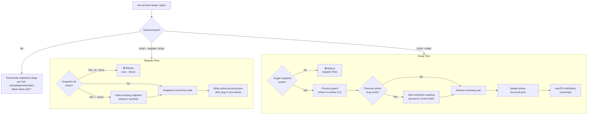
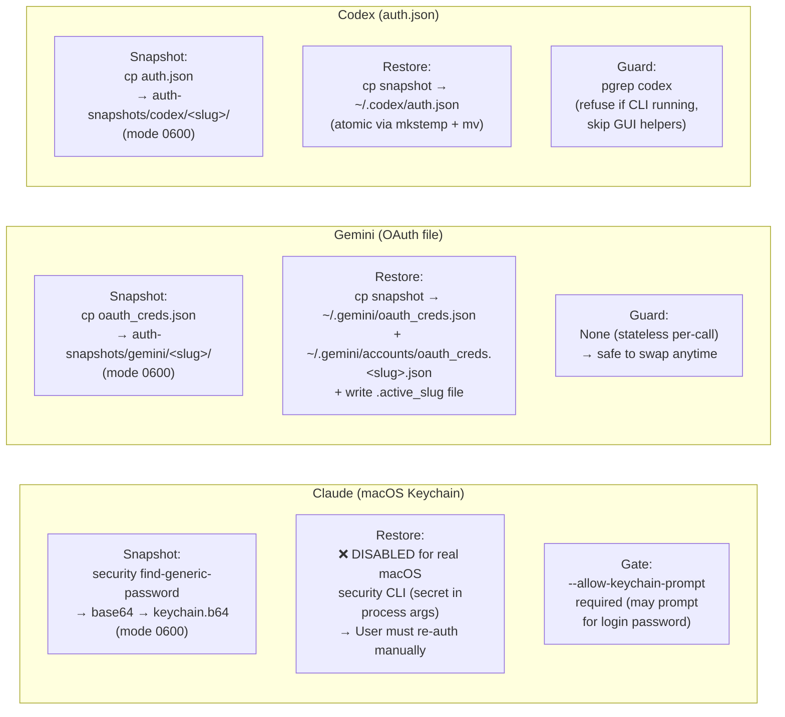
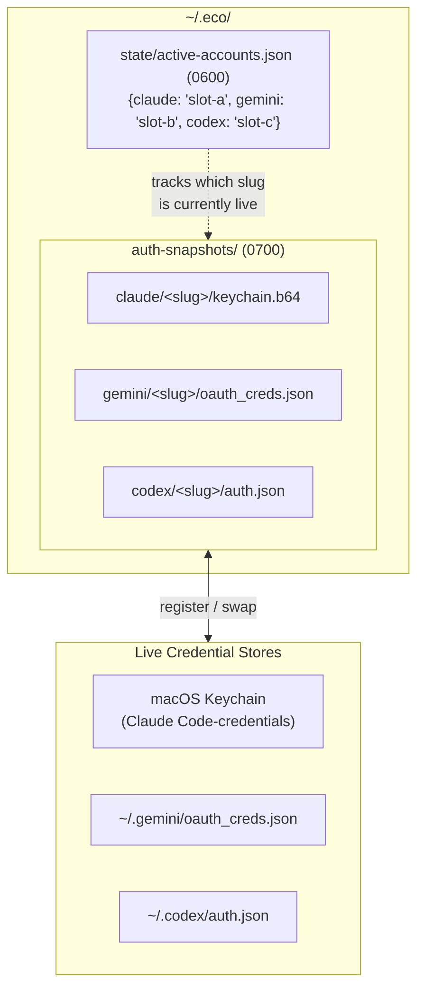

# Account Swap Flow

Credential rotation lifecycle for `eco account-swap` (`src/recipes/account-swap.sh`).

## Command Dispatch

## Per-Tool Credential Paths

## Storage Layout

## Source References

| Component | Source |
|-----------|--------|
| Recipe script | [`src/recipes/account-swap.sh`](../../src/recipes/account-swap.sh) |
| BATS tests | [`tests/bats/09_account_swap.bats`](../../tests/bats/09_account_swap.bats) |

**Related docs:** [Architecture](../architecture.md) · [Recipes](../subsystems/recipes.md) · [Security Model](../operations/security-model.md) · [Runbook §7](../operations/runbook.md)
