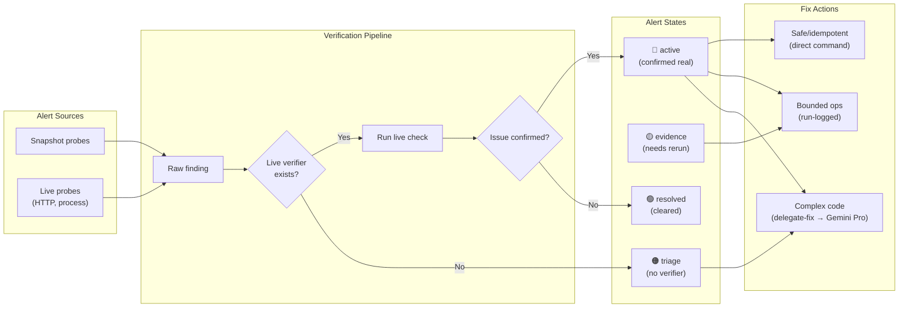

# Alert Pipeline

How `src/bin/eco-alerts.sh` routes raw findings through live verification and
into one of four states (active, evidence, triage, resolved) before dispatching
a fix action.

## Source References

| Component | Source |
|-----------|--------|
| Alert engine | [`src/bin/eco-alerts.sh`](../../src/bin/eco-alerts.sh) |
| BATS tests | [`tests/bats/06_eco_alerts.bats`](../../tests/bats/06_eco_alerts.bats) |

**Related docs:** [Architecture](../architecture.md) · [Alert System](../subsystems/alerts.md) · [Widget Health](../subsystems/widget-health.md) · [Runbook §1](../operations/runbook.md)
