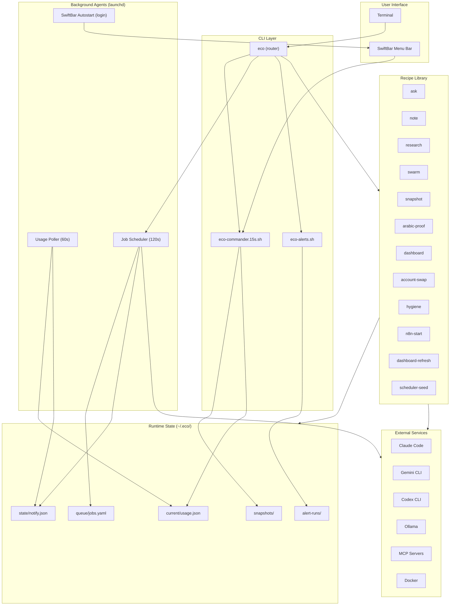

# Architecture Diagram

Top-level component map of eco-commander: how the CLI, background agents,
recipes, state directories, and external AI tools relate to each other.

## Source References

| Component | Source |
|-----------|--------|
| CLI router | [`src/bin/eco`](../../src/bin/eco) |
| SwiftBar widget | [`src/bin/eco-commander.15s.sh`](../../src/bin/eco-commander.15s.sh) |
| Recipe library | [`src/recipes/`](../../src/recipes/) |
| Poller | [`src/poller/`](../../src/poller/) |
| Scheduler | [`src/scheduler/`](../../src/scheduler/) |

**Related docs:** [Architecture](../architecture.md) · [README](../../README.md) · [ADR 0002](../adr/0002-bash-implementation.md) · [ADR 0004](../adr/0004-usage-monitor-python-carveout.md) · [ADR 0005](../adr/0005-job-scheduler.md)
