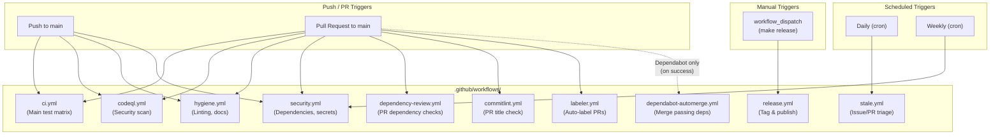
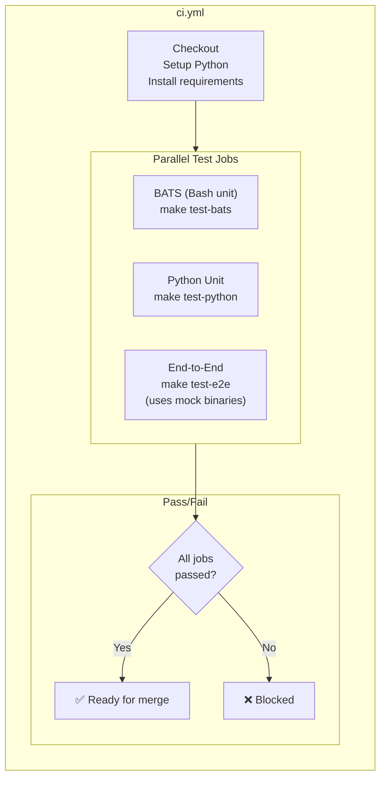
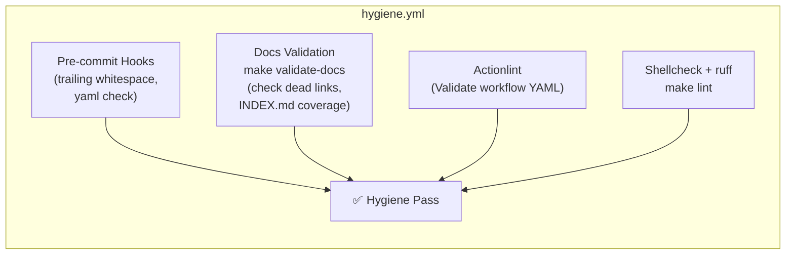
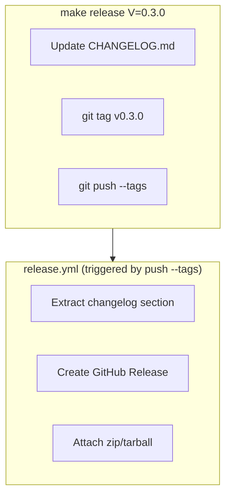

# CI/CD Pipeline

GitHub Actions workflow topography for eco-commander.

## Workflow Triggers

## `ci.yml` — Main Test Matrix

## `hygiene.yml` — Repository Health

## `release.yml` — Tag and Publish

## Source References

| Component | Source |
|-----------|--------|
| CI workflow | [`.github/workflows/ci.yml`](../../.github/workflows/ci.yml) |
| Release workflow | [`.github/workflows/release.yml`](../../.github/workflows/release.yml) |
| Security workflow | [`.github/workflows/security.yml`](../../.github/workflows/security.yml) |
| Hygiene workflow | [`.github/workflows/hygiene.yml`](../../.github/workflows/hygiene.yml) |
| Release script | [`scripts/release.sh`](../../scripts/release.sh) |
| Lint script | [`scripts/lint.sh`](../../scripts/lint.sh) |

**Related docs:** [Architecture](../architecture.md) · [CONTRIBUTING.md](../../CONTRIBUTING.md) · [Testing](../contributing/testing.md) · [Developer Hygiene](../contributing/developer-hygiene.md)
