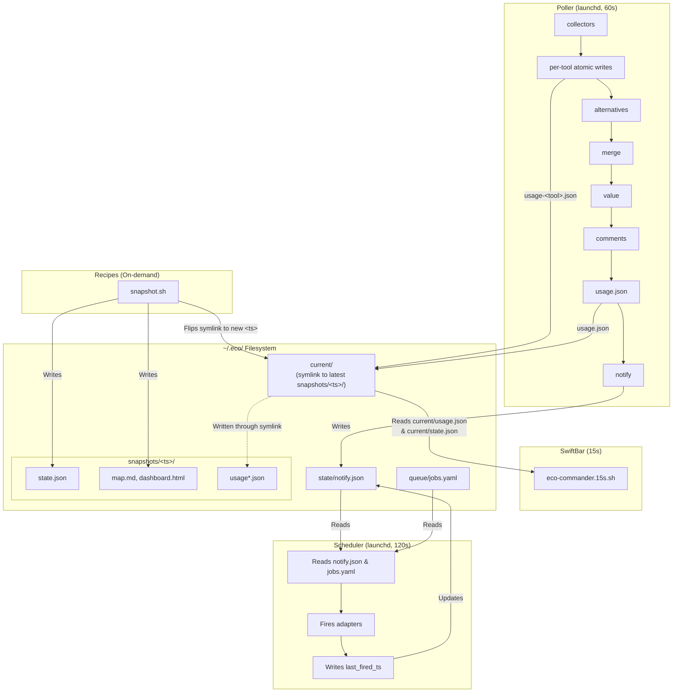

# Data Flow

End-to-end data flow from the 60-second poller collectors through the merged `usage.json`, into the scheduler's meter-gated dispatch loop, and up to the SwiftBar widget, highlighting the on-demand snapshot recipe that rotates the base state directory.

## Source References

| Component | Source |
|-----------|--------|
| Poller | [`src/poller/main.py`](../../src/poller/main.py) |
| Scheduler | [`src/scheduler/dispatcher.py`](../../src/scheduler/dispatcher.py) |
| Widget | [`src/bin/eco-commander.15s.sh`](../../src/bin/eco-commander.15s.sh) |
| Snapshot | [`src/recipes/snapshot.sh`](../../src/recipes/snapshot.sh) |

**Related docs:** [Architecture](../architecture.md) · [Data Model](../reference/data-model.md) · [Filesystem Layout](filesystem-layout.md) · [Usage Monitor](../subsystems/usage-monitor.md)
