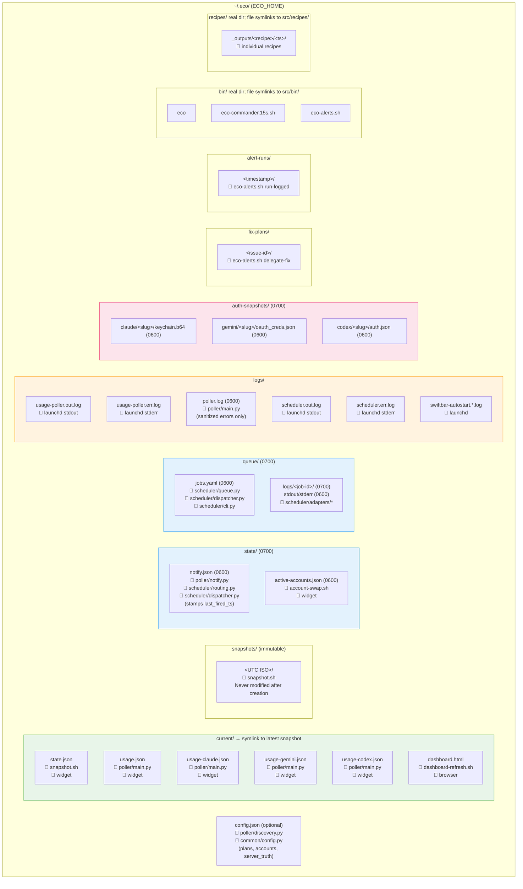

# Filesystem Layout — `~/.eco/` Ownership Map

Runtime directory tree with writer attribution and file permissions.

## Legend

| Symbol | Meaning |
|--------|---------|
| 📝 | **Writer** — the subsystem that creates/updates this file |
| 📖 | **Reader** — subsystem(s) that consume this file |
| `(0600)` | Owner-only read/write |
| `(0700)` | Owner-only access on directory |

## Writer Color Key

| Color | Subsystem |
|-------|-----------|
| 🟢 Green | Snapshot + Poller (data producers) |
| 🔵 Blue | Scheduler (job dispatch) |
| 🔴 Pink | Account swap (credentials) |
| 🟠 Orange | LaunchAgent logs |

## Source References

| Component | Source |
|-----------|--------|
| Install script | [`scripts/install.sh`](../../scripts/install.sh) |
| Config loader | [`src/common/config.py`](../../src/common/config.py) |
| Discovery flags | [`src/poller/discovery.py`](../../src/poller/discovery.py) |

**Related docs:** [Architecture](../architecture.md) · [Installation](../getting-started/installation.md) · [Data Model](../reference/data-model.md) · [Security Model](../operations/security-model.md) · [Environment Variables](../reference/environment-variables.md)
