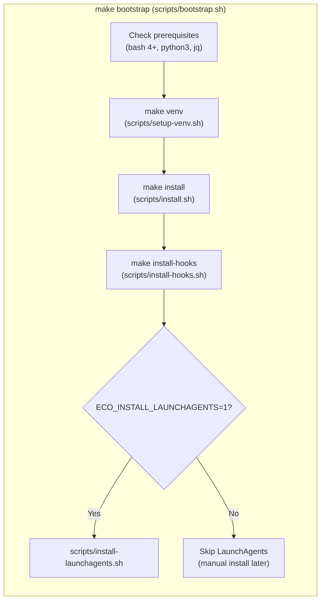
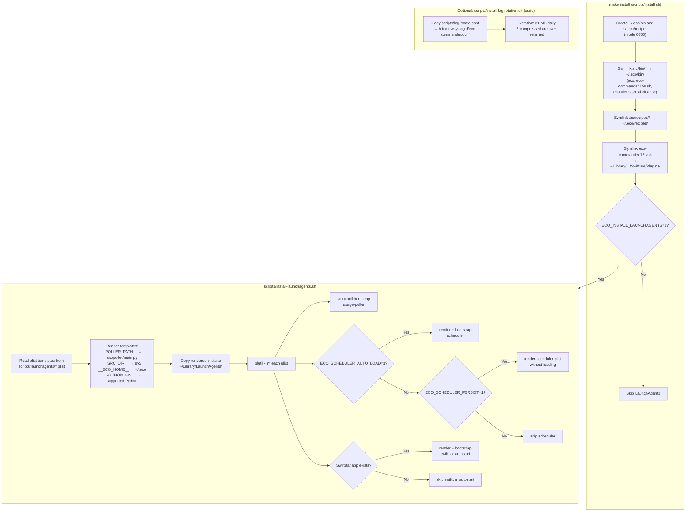
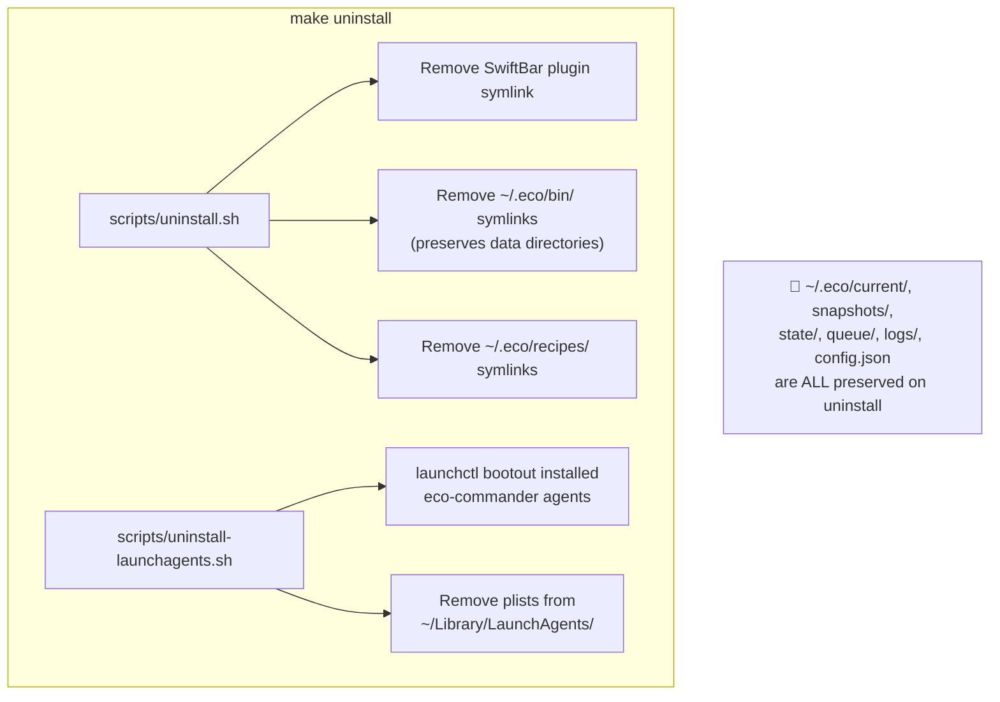
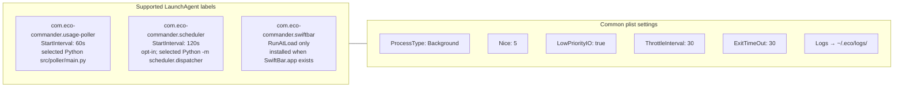

# Install Lifecycle

Installation, setup, and teardown flow for eco-commander.

## Full Bootstrap

## Install Detail

## Uninstall

## LaunchAgent Agents

## Source References

| Component | Source |
|-----------|--------|
| Bootstrap | [`scripts/bootstrap.sh`](../../scripts/bootstrap.sh) |
| Install | [`scripts/install.sh`](../../scripts/install.sh) |
| Uninstall | [`scripts/uninstall.sh`](../../scripts/uninstall.sh) |
| LaunchAgents | [`scripts/install-launchagents.sh`](../../scripts/install-launchagents.sh) |
| Plist templates | [`scripts/launchagents/`](../../scripts/launchagents/) |
| Log rotation | [`scripts/install-log-rotation.sh`](../../scripts/install-log-rotation.sh) |
| Healthcheck | [`scripts/healthcheck.sh`](../../scripts/healthcheck.sh) |

`scripts/healthcheck.sh` is an operator validation command, not an automatic
step in `make install`.

**Related docs:** [Architecture](../architecture.md) · [Installation](../getting-started/installation.md) · [Runbook §6](../operations/runbook.md) · [Filesystem Layout](filesystem-layout.md)
