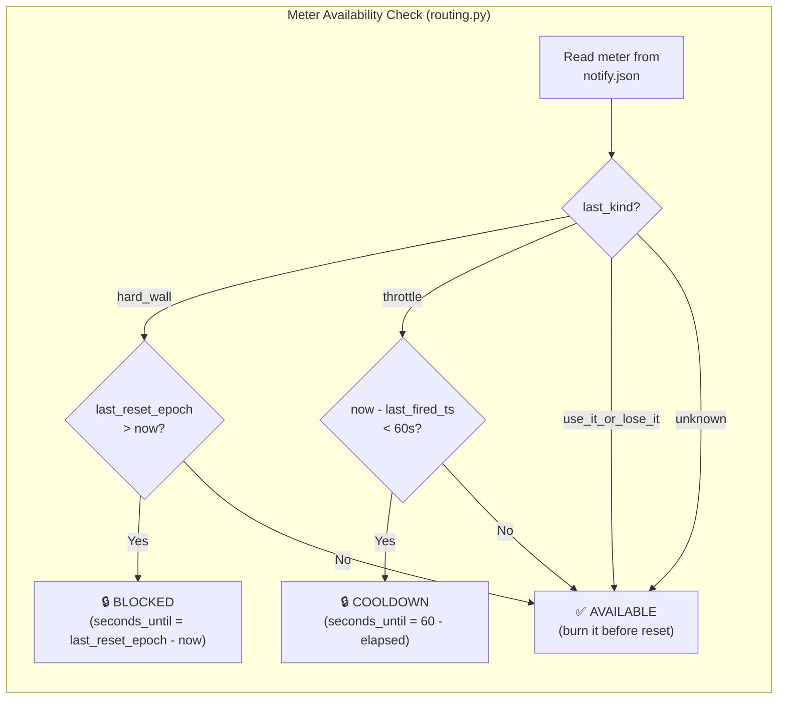
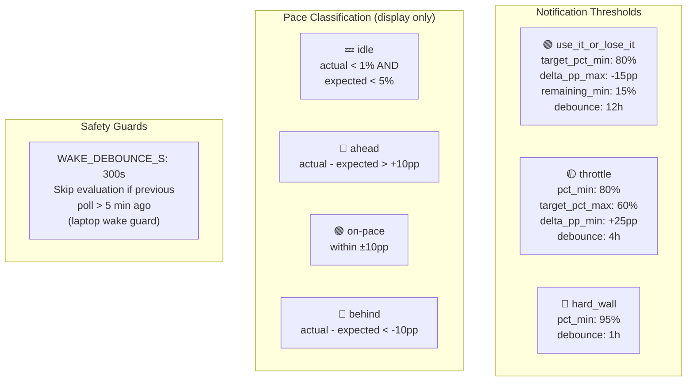
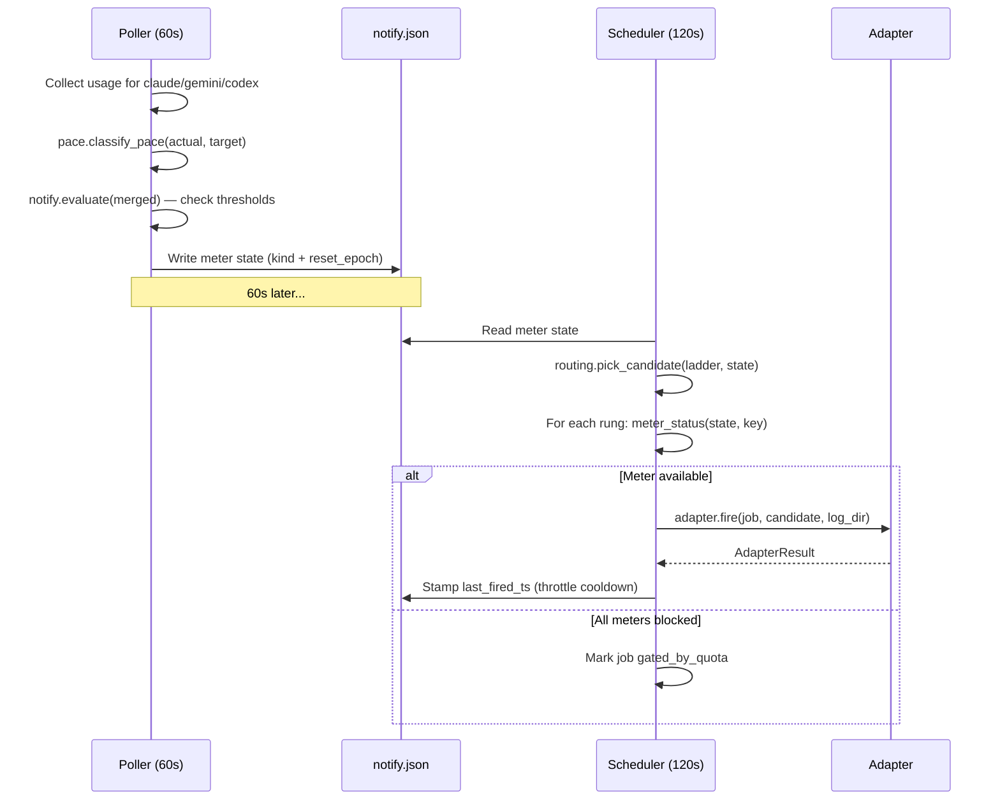

# Meter State Machine

Quota meters bridge the poller (`src/poller/notify.py` + `pace.py`) and the
scheduler (`src/scheduler/routing.py`). Each meter tracks one quota bucket
(e.g., `gemini.tiers.flash`, `codex.session`, `claude.weekly`).

## State Transitions

```mermaid
stateDiagram-v2
    [*] --> unknown : First poller cycle\n(no data yet)

    unknown --> hard_wall : pct &gt;= 95
    unknown --> throttle : pct &gt;= 80 AND target &lt;= 60 AND delta &gt;= +25
    unknown --> use_it_or_lose_it : target &gt;= 80 AND delta &lt;= -15 AND (100 - pct) &gt;= 15
    unknown --> healthy : else -&gt; None -&gt; written as "healthy"

    healthy --> hard_wall : pct &gt;= 95
    healthy --> throttle : pct &gt;= 80 AND target &lt;= 60 AND delta &gt;= +25
    healthy --> use_it_or_lose_it : target &gt;= 80 AND delta &lt;= -15 AND (100 - pct) &gt;= 15

    use_it_or_lose_it --> hard_wall : pct &gt;= 95
    use_it_or_lose_it --> throttle : pct &gt;= 80 AND target &lt;= 60 AND delta &gt;= +25
    use_it_or_lose_it --> healthy : else -&gt; None -&gt; written as "healthy"

    throttle --> hard_wall : pct &gt;= 95
    throttle --> use_it_or_lose_it : target &gt;= 80 AND delta &lt;= -15 AND (100 - pct) &gt;= 15
    throttle --> healthy : else -&gt; None -&gt; written as "healthy"

    hard_wall --> throttle : pct &gt;= 80 AND target &lt;= 60 AND delta &gt;= +25
    hard_wall --> use_it_or_lose_it : target &gt;= 80 AND delta &lt;= -15 AND (100 - pct) &gt;= 15
    hard_wall --> healthy : else -&gt; None -&gt; written as "healthy"
```

## Scheduler Availability Rules



## Threshold Constants (from `pace.py`)



## Interaction with Scheduler Dispatch



## Source References

| Component | Source |
|-----------|--------|
| Threshold constants | [`src/poller/pace.py`](../../src/poller/pace.py) — `THRESHOLDS`, `DEBOUNCE_HOURS`, `WAKE_DEBOUNCE_S` |
| Classification logic | [`src/poller/notify.py`](../../src/poller/notify.py) — `_classify()` |
| Meter definitions | [`src/poller/notify.py`](../../src/poller/notify.py) — `METERS` list |
| Scheduler routing | [`src/scheduler/routing.py`](../../src/scheduler/routing.py) — `meter_status()`, `pick_candidate()` |
| Adapter dispatch | [`src/scheduler/dispatcher.py`](../../src/scheduler/dispatcher.py) |

**Related docs:** [Architecture](../architecture.md) · [Scheduler](../subsystems/scheduler.md) · [Usage Monitor](../subsystems/usage-monitor.md) · [ADR 0005](../adr/0005-job-scheduler.md)
