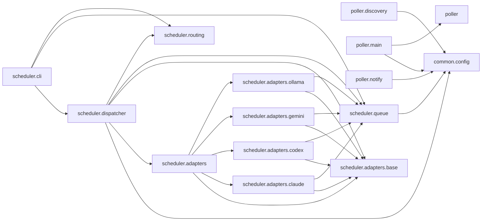

# Module Dependency Graph

Internal import dependency graph across eco-commander's Python packages
(`common`, `poller`, `scheduler`). Auto-generated from `src/tools/dep_graph.py`. Regenerate with:

```bash
PYTHONPATH=src python3 -m tools.dep_graph --format=mermaid
```



**Key observations:**
- `common.config` is the shared dependency root — imported by both poller and scheduler subsystems
- No circular dependencies detected
- Poller modules with internal imports (`pace.py` → `caps.py`) use relative imports within the package and are not captured at the cross-package level by `dep_graph.py`
- All four scheduler adapters share the same dependency pattern: `adapters.base` + `queue`

**Related docs:** [Architecture](../architecture.md) · [Poller Pipeline](poller-pipeline.md) · [Scheduler Flow](scheduler-flow.md)
