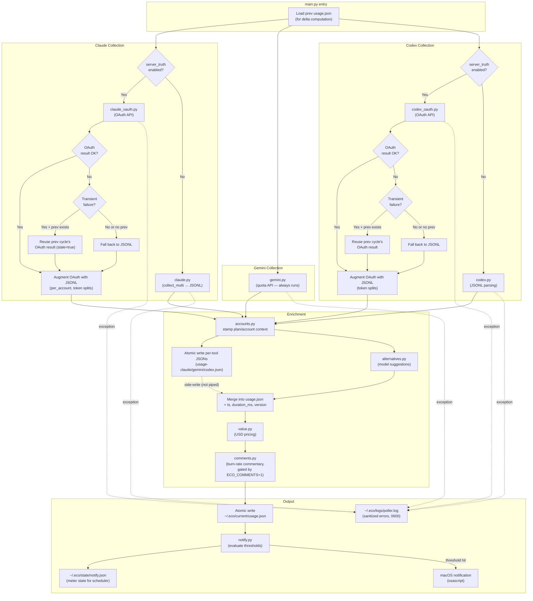

# Poller Data Pipeline

Detailed view of `src/poller/main.py` — the 60-second usage collection cycle.

## Source References

| Component | Source |
|-----------|--------|
| Entry point | [`src/poller/main.py`](../../src/poller/main.py) |
| Claude JSONL | [`src/poller/claude.py`](../../src/poller/claude.py) |
| Claude OAuth | [`src/poller/claude_oauth.py`](../../src/poller/claude_oauth.py) |
| Gemini collector | [`src/poller/gemini.py`](../../src/poller/gemini.py) |
| Codex JSONL | [`src/poller/codex.py`](../../src/poller/codex.py) |
| Codex OAuth | [`src/poller/codex_oauth.py`](../../src/poller/codex_oauth.py) |
| Account stamping | [`src/poller/accounts.py`](../../src/poller/accounts.py) |
| Alternatives | [`src/poller/alternatives.py`](../../src/poller/alternatives.py) |
| USD pricing | [`src/poller/value.py`](../../src/poller/value.py) |
| Burn-rate comments | [`src/poller/comments.py`](../../src/poller/comments.py) |
| Notification eval | [`src/poller/notify.py`](../../src/poller/notify.py) |
| LaunchAgent plist | [`scripts/launchagents/`](../../scripts/launchagents/) |

**Related docs:** [Architecture](../architecture.md) · [Usage Monitor](../subsystems/usage-monitor.md) · [ADR 0004](../adr/0004-usage-monitor-python-carveout.md) · [Data Model](../reference/data-model.md)

