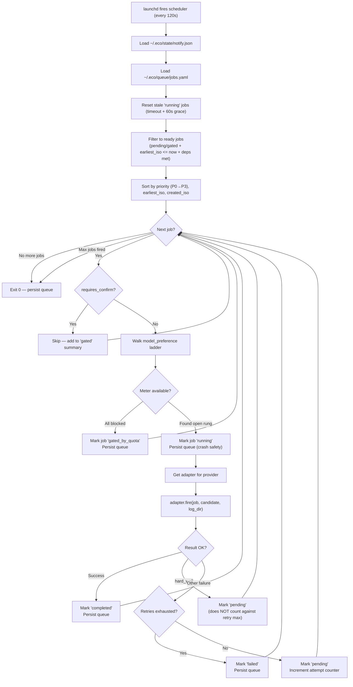

# Scheduler Dispatch Flow

Single-pass dispatch loop executed by `src/scheduler/dispatcher.py` every
120 seconds under launchd — reads the job queue, walks each job's
model-preference ladder, fires via the first available meter, and persists
state atomically before exiting.

## Source References

| Component | Source |
|-----------|--------|
| CLI surface | [`src/scheduler/cli.py`](../../src/scheduler/cli.py) |
| Dispatch loop | [`src/scheduler/dispatcher.py`](../../src/scheduler/dispatcher.py) |
| Job queue | [`src/scheduler/queue.py`](../../src/scheduler/queue.py) |
| Routing / meter check | [`src/scheduler/routing.py`](../../src/scheduler/routing.py) |
| Adapters | [`src/scheduler/adapters/`](../../src/scheduler/adapters/) |
| LaunchAgent plist | [`scripts/launchagents/`](../../scripts/launchagents/) |

**Related docs:** [Architecture](../architecture.md) · [Scheduler](../subsystems/scheduler.md) · [ADR 0005](../adr/0005-job-scheduler.md) · [Runbook §3](../operations/runbook.md) · [Runbook §8](../operations/runbook.md)
