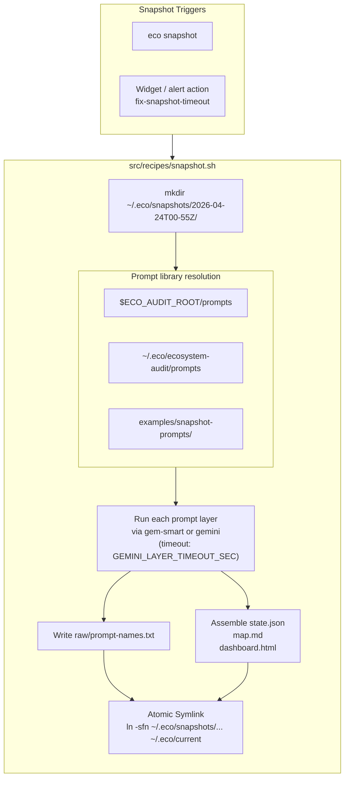
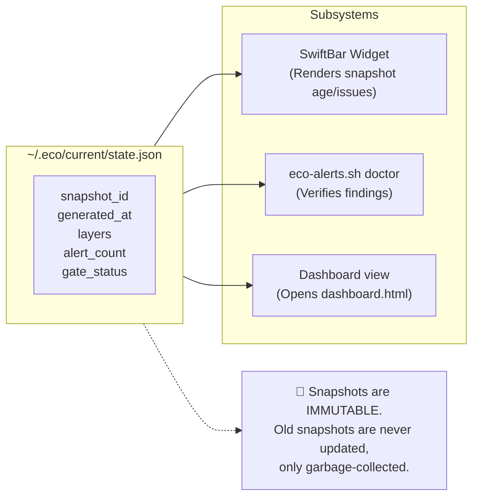

# Snapshot Lifecycle

How snapshots are created and consumed by the ecosystem.

## Write Path

## Read Path (Consumers)

## Source References

| Component | Source |
|-----------|--------|
| Snapshot recipe | [`src/recipes/snapshot.sh`](../../src/recipes/snapshot.sh) |
| BATS tests | [`tests/bats/recipes/`](../../tests/bats/recipes/) |

**Related docs:** [Architecture](../architecture.md) · [Snapshots](../subsystems/snapshots.md) · [ADR 0003](../adr/0003-snapshot-immutability.md) · [Data Model](../reference/data-model.md)
