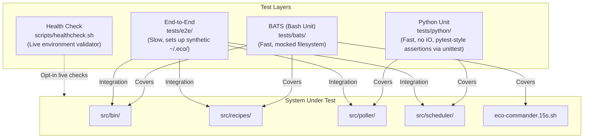
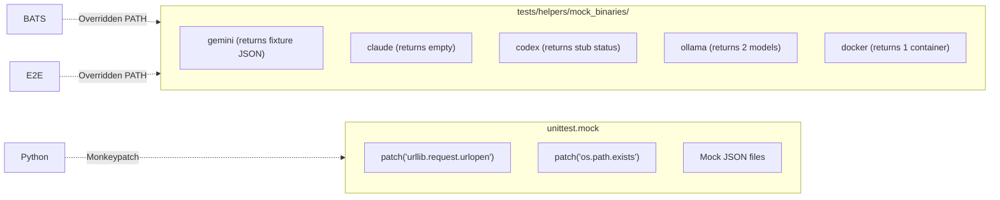

# Test Architecture

Testing strategy and layer mapping for eco-commander.

## Running Tests

| Command | Suite | Speed | Isolation |
|---------|-------|-------|-----------|
| `make test-bats` | Bash Unit | Very fast | Mocked binaries (`$PATH` override) |
| `make test-python` | Python Unit | Very fast | Patched objects, no IO |
| `make test-fast` | Bash + Python | Very fast | Full unit coverage |
| `make test-e2e` | End-to-End | Slow (~5s) | Synthetic `$ECO_HOME` dir |
| `make test` | All three suites | Slow | Full confidence |

## Mocking Boundaries

## Source References

| Component | Source |
|-----------|--------|
| BATS suites | [`tests/bats/`](../../tests/bats/) |
| Python unit tests | [`tests/python/`](../../tests/python/) |
| E2E harness | [`tests/e2e/run_e2e.sh`](../../tests/e2e/run_e2e.sh) |
| Test runner | [`tests/run-all.sh`](../../tests/run-all.sh) |
| Shared helpers | [`tests/helpers/common.bash`](../../tests/helpers/common.bash) |
| Coverage map | [`tests/COVERAGE_MAP.md`](../../tests/COVERAGE_MAP.md) |

**Related docs:** [Architecture](../architecture.md) · [Testing](../contributing/testing.md) · [CONTRIBUTING.md](../../CONTRIBUTING.md) · [CI Pipeline](ci-pipeline.md)
