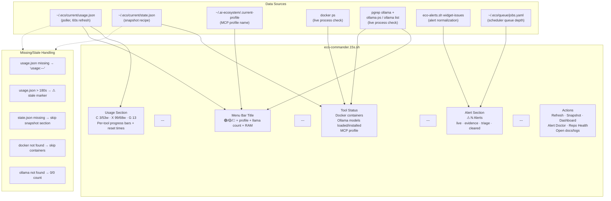
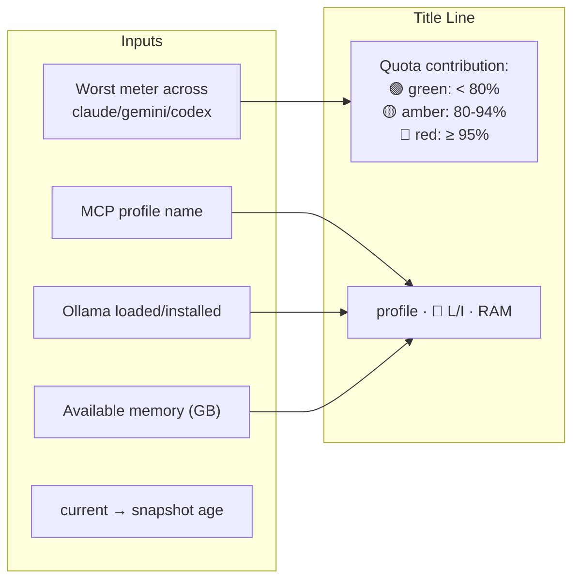
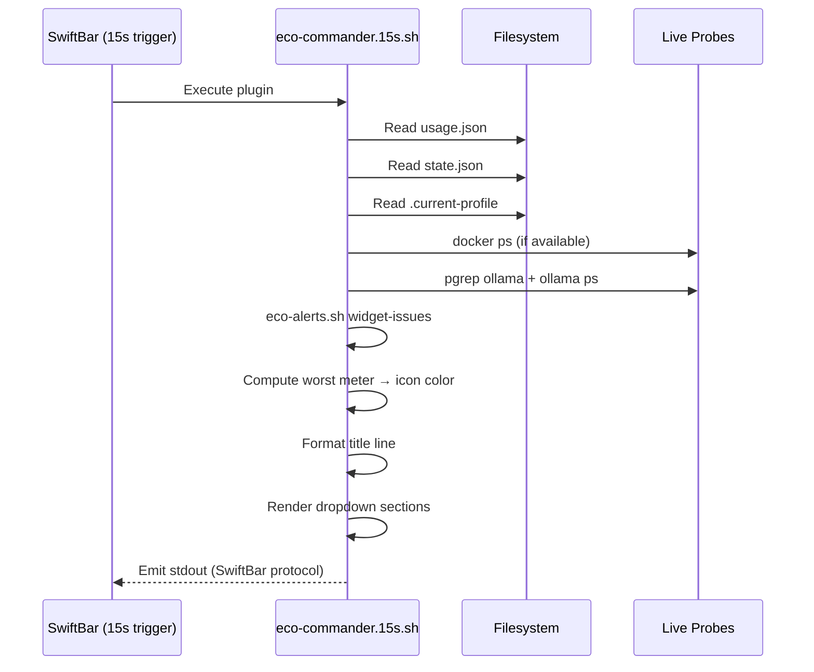

# Widget Rendering — Data Sources

How `eco-commander.15s.sh` (35KB) assembles the SwiftBar menu bar widget.

## Data Source Map

## Menu Bar Title Composition

## Rendering Sequence

## Source References

| Component | Source |
|-----------|--------|
| Widget script | [`src/bin/eco-commander.15s.sh`](../../src/bin/eco-commander.15s.sh) |
| Alert normalization | [`src/bin/eco-alerts.sh`](../../src/bin/eco-alerts.sh) |
| Usage data producer | [`src/poller/main.py`](../../src/poller/main.py) |

**Related docs:** [Architecture](../architecture.md) · [Widget Health](../subsystems/widget-health.md) · [Usage Monitor](../subsystems/usage-monitor.md) · [Data Model](../reference/data-model.md)
