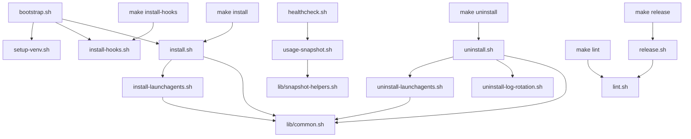

# scripts/ — Eco-Commander Scripts

> Automation, lifecycle management, and operational tooling for the eco-commander
> AI usage monitoring ecosystem.
>
> **20 scripts · 2 libraries · 1 config · 3 plist templates** — Last updated: 2026-06-06

## Quick Reference

| Script | Purpose | Run As |
|--------|---------|--------|
| `bootstrap.sh` | One-command dev environment setup (Brewfile, venv, hooks, install, smoke test) | User |
| `setup-venv.sh` | Create Python venv and install dev dependencies | User |
| `install.sh` | Symlink `src/` → `~/.eco/`, register SwiftBar plugin | User |
| `uninstall.sh` | Remove symlinks (preserves data) | User |
| `install-launchagents.sh` | Register macOS LaunchAgents | User |
| `uninstall-launchagents.sh` | Remove LaunchAgents | User |
| `install-hooks.sh` | Install pre-commit + commit-msg hooks | User |
| `install-log-rotation.sh` | Install newsyslog rotation rules | Sudo |
| `uninstall-log-rotation.sh` | Remove newsyslog rotation rules | User |
| `doctor.sh` | Diagnose and repair installation (symlinks, config, logs) | User |
| `healthcheck.sh` | E2E health check (all subsystems) | User |
| `usage-snapshot.sh` | Generate shareable PNG+TXT snapshot | User |
| `run-poller.sh` | Run usage poller manually | User |
| `run-scheduler.sh` | Run scheduler dispatcher manually | User |
| `run-alerts.sh` | Run eco-alerts with correct PYTHONPATH | User |
| `toggle-precise.sh` | Toggle server-truth tracking per tool | User |
| `lint.sh` | Run shellcheck on all scripts | User |
| `release.sh` | Tag and push a release | User |
| `validate-commit-message.sh` | Validate Conventional Commits format | Hook |
| `verify-manifest.sh` | Verify MANIFEST.yaml against filesystem | User |

## Directory Structure

```
scripts/
├── lib/                          # Shared bash libraries
│   ├── common.sh                 # validate_install_path, plist_label_matches, die
│   └── snapshot-helpers.sh       # humanize, bar_fill, safe_pct, color_for, etc.
├── launchagents/                 # macOS LaunchAgent plist templates
│   ├── com.eco-commander.scheduler.plist
│   ├── com.eco-commander.swiftbar.plist
│   └── com.eco-commander.usage-poller.plist
├── bootstrap.sh                  # One-command dev env setup (new contributors)
├── setup-venv.sh                 # Python venv creation and dependency install
├── install.sh                    # Main installer
├── uninstall.sh                  # Reverse installer
├── install-launchagents.sh       # LaunchAgent registration
├── uninstall-launchagents.sh     # LaunchAgent removal
├── install-hooks.sh              # Git hooks setup
├── install-log-rotation.sh       # newsyslog rotation (requires sudo)
├── uninstall-log-rotation.sh     # remove newsyslog rotation rule
├── doctor.sh                     # Diagnose and repair installation
├── healthcheck.sh                # End-to-end health check
├── usage-snapshot.sh             # PNG+TXT snapshot generator
├── run-poller.sh                 # Poller wrapper
├── run-scheduler.sh              # Scheduler wrapper
├── run-alerts.sh                 # Alerts wrapper
├── toggle-precise.sh             # Server-truth toggle
├── lint.sh                       # shellcheck runner
├── release.sh                    # Release automation
├── validate-commit-message.sh    # Commit message validator
├── verify-manifest.sh            # MANIFEST.yaml vs filesystem integrity check
└── log-rotate.conf               # newsyslog config template
```

## Script Categories

### Setup (New Contributors)

- **`bootstrap.sh`** — Idempotent one-command setup for new contributors. Runs Brewfile,
  creates the Python venv, installs Git hooks, calls `make install`, then runs a smoke test.
  Entry point documented in `CONTRIBUTING.md`.
- **`setup-venv.sh`** — Creates a Python venv and installs dev dependencies from
  `requirements-dev.txt` / `pyproject.toml`. Auto-selects Python 3.13→3.10; refuses
  Python 3.14 (breaks CadQuery/Open3D-type deps). Accepts `PYTHON_BIN` override.

### Lifecycle (Install/Uninstall)

These scripts manage the installation and removal of eco-commander components:

- **`install.sh`** — Creates symlinks from `src/bin/` and `src/recipes/` into `~/.eco/`.
  Registers the SwiftBar plugin. Optionally installs LaunchAgents via
  `ECO_INSTALL_LAUNCHAGENTS=1`.
- **`uninstall.sh`** — Removes only symlinks owned by this repo. Preserves user data,
  snapshots, and logs. Calls `uninstall-launchagents.sh`.
- **`install-launchagents.sh`** — Renders plist templates (replacing `__POLLER_PATH__`,
  `__SRC_DIR__`, `__ECO_HOME__`) and registers them with `launchctl`.
- **`uninstall-launchagents.sh`** — Stops and removes eco-commander LaunchAgents.
  Validates plist labels before removal to avoid touching foreign agents.
- **`install-hooks.sh`** — Installs pre-commit hooks via `pre-commit install`.
- **`install-log-rotation.sh`** — Renders `log-rotate.conf` template and installs to
  `/etc/newsyslog.d/`. Requires sudo.
- **`uninstall-log-rotation.sh`** — Removes only the eco-commander-marked
  newsyslog drop-in. Preserves logs and skips foreign files.

### Runtime / Operations

- **`doctor.sh`** — Diagnoses and optionally repairs the eco-commander installation:
  checks symlinks, config validity, log directories, and usage data freshness.
  Use `--fix` for safe auto-repair of broken symlinks and config. Non-destructive by default.
- **`healthcheck.sh`** — Comprehensive E2E test: checks required binaries, optionally
  validates LaunchAgent status, runs snapshot under restricted PATH, tests widget
  rendering. Supports `--json` output.
- **`usage-snapshot.sh`** — Generates a shareable AI usage card (PNG via qlmanage + TXT).
  Copies to clipboard, reveals in Finder, sends macOS notification.
- **`run-poller.sh`** — Thin wrapper setting PYTHONPATH and running `poller.main`.
- **`run-scheduler.sh`** — Thin wrapper setting PYTHONPATH and running `scheduler.dispatcher`.
- **`run-alerts.sh`** — Thin wrapper setting PYTHONPATH and invoking `src/bin/eco-alerts.sh`.
- **`toggle-precise.sh`** — Toggles per-tool server-truth tracking in `~/.eco/config.json`.
  Requires `ECO_ALLOW_LIVE_CREDENTIAL_PROBE=1` to enable. Race-safe via flock or mkdir fallback.

### CI / Dev Tools

- **`lint.sh`** — Runs shellcheck on all `.sh` files in `src/` and `scripts/`.
- **`release.sh`** — Tags and pushes a semver release. Validates changelog entry,
  version in `src/scheduler/__init__.py`, clean working tree, main branch.
- **`validate-commit-message.sh`** — Validates Conventional Commits format.
  Used as a commit-msg hook.
- **`verify-manifest.sh`** — Verifies `scripts/MANIFEST.yaml` against the actual filesystem:
  checks that every listed path exists, detects unlisted scripts, and validates line counts.
  Supports `--fix` to auto-update line counts in `MANIFEST.yaml`.

### Shared Libraries (`lib/`)

- **`lib/common.sh`** — Shared functions sourced by install/uninstall scripts:
  - `validate_install_path` — Refuses sensitive macOS paths, symlinks, iCloud, and other users' home directories
  - `plist_label_matches` — Checks plist Label key against expected value
  - `die` — Fallback error handler (overridden by callers before sourcing)

- **`lib/snapshot-helpers.sh`** — Pure formatting functions sourced by `usage-snapshot.sh`:
  - `humanize` — Number → human-readable (1500 → "1.50K")
  - `bar_fill` — Percentage → 20-char Unicode progress bar
  - `safe_pct` — Clamp to [0,100] with %.1f formatting
  - `color_for` — Percentage → hex color (green/amber/red)
  - `html_escape` — HTML entity escaping via Python
  - `pace_glyph` — Pace label → emoji (🐎/🐢)
  - `target_mark` — Percentage → HTML overlay div
  - `acct_label` — Format "Plan × N" if N > 1
  - `_join` — Join args with " · " separator

### Configuration

- **`log-rotate.conf`** — newsyslog(5) template. Uses `__ECO_HOME__` and `__USER__`
  placeholders rendered by `install-log-rotation.sh`.
- **`launchagents/*.plist`** — LaunchAgent templates using `__POLLER_PATH__`, `__SRC_DIR__`,
  `__ECO_HOME__` placeholders.

## Environment Variables

| Variable | Used By | Default | Purpose |
|----------|---------|---------|---------|
| `ECO_HOME` | Most scripts | `~/.eco` | Root data directory |
| `SWIFTBAR_PLUGIN_DIR` | install/uninstall | `~/Library/Application Support/SwiftBar/Plugins` | Plugin location |
| `ECO_INSTALL_LAUNCHAGENTS` | install.sh | `0` | Auto-install LaunchAgents |
| `ECO_SCHEDULER_AUTO_LOAD` | install-launchagents.sh | `0` | Load scheduler on install |
| `ECO_SCHEDULER_PERSIST` | install-launchagents.sh | `0` | Install but don't load scheduler |
| `ECO_ALLOW_LIVE_CREDENTIAL_PROBE` | toggle-precise.sh | `0` | Allow Keychain/auth probes |
| `ECO_SNAPSHOT_CLIPBOARD` | usage-snapshot.sh | `1` | Copy snapshot to clipboard |
| `ECO_SNAPSHOT_REVEAL` | usage-snapshot.sh | `1` | Reveal in Finder |
| `ECO_SNAPSHOT_NOTIFY` | usage-snapshot.sh | `1` | Send macOS notification |
| `ECO_HEALTHCHECK_MACOS_SURFACES` | healthcheck.sh | `0` | Check LaunchAgents/SwiftBar |
| `ECO_HEALTHCHECK_LIVE_RUNTIME` | healthcheck.sh | `0` | Check live usage.json |
| `ECO_LAUNCHAGENTS_DIR` | install/uninstall-launchagents | `~/Library/LaunchAgents` | Override plist destination |

## Script Call Graph



## Dependencies

All scripts require:
- **bash** ≥ 3.2 (macOS default)
- **python3** (for path validation, plist handling, HTML escaping)

Additional per-script:
- `bootstrap.sh`: brew, make, pre-commit
- `setup-venv.sh`: python3, pip (auto-selects 3.13→3.10; refuses 3.14)
- `doctor.sh`: jq, python3
- `healthcheck.sh`: jq, qlmanage, osascript, pbcopy
- `usage-snapshot.sh`: jq, qlmanage, osascript, pbcopy
- `lint.sh`: shellcheck (`brew install shellcheck`)
- `install-hooks.sh`: pre-commit (`pip install pre-commit`)
- `release.sh`: git
- `install-log-rotation.sh`: sudo, newsyslog
- `uninstall-log-rotation.sh`: sudo
- `verify-manifest.sh`: python3

## Related Directories

- **`examples/missions/`** — Example scheduler mission YAMLs (e.g. `seed-jobs.example.yaml`)
- **`src/bin/`** — Installed binaries (eco CLI, SwiftBar widget)
- **`src/poller/`** — Usage poller Python package
- **`src/scheduler/`** — Job scheduler Python package
- **`src/recipes/`** — Reusable automation recipes
- **`tests/`** — BATS + Python test suites
