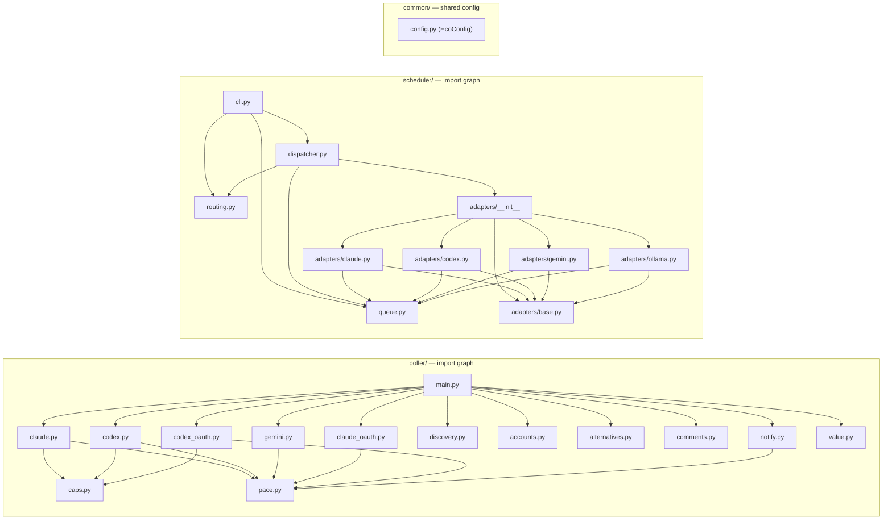

# AI Navigation Index — `src/`

> **Purpose**: Single lookup entry for AI agents navigating the eco-commander source tree.
> **Last generated**: 2026-06-04 · **Total files**: 59 · **Total bytes**: ~367 KB

---

## Quick-Reference Lookup

| I need to… | Touch these files |
|---|---|
| Add a new AI tool collector | `poller/<tool>.py`, `poller/main.py`, `poller/caps.py`, `poller/accounts.py` |
| Add OAuth for a tool | `poller/<tool>_oauth.py`, `poller/discovery.py`, `poller/main.py` |
| Add a scheduler adapter | `scheduler/adapters/<provider>.py`, `scheduler/adapters/__init__.py` |
| Change notification logic | `poller/notify.py`, `poller/pace.py` |
| Change token cap calibration | `poller/caps.py` (constants only) |
| Add a new recipe | `recipes/<name>.sh` (auto-discovered by `eco list`) |
| Change CLI routing | `bin/eco` |
| Change value-model loading | `poller/value.py` (`ECO_VALUE_MODEL_JSON`) |
| Change account inventory | `poller/accounts.py` (_CONTEXT dict) |
| Add a queue job template | `scheduler/adapters/<provider>.py` (_render_prompt method) |
| Debug widget display | `bin/eco-commander.15s.sh` (SwiftBar renderer) |
| Fix a scheduler bug | `scheduler/dispatcher.py`, `scheduler/queue.py`, `scheduler/routing.py` |

---

## File Registry

### `src/bin/` — Shell CLI Layer (5 files, ~87 KB)

| File | Lines | Bytes | Purpose | Entry Point |
|---|---|---|---|---|
| `eco` | 110 | 3.1K | CLI router — dispatches all subcommands | `eco <cmd>` |
| `eco-commander.15s.sh` | ~1200 | 37.3K | SwiftBar plugin + `--cli` status panel | SwiftBar / `eco status` |
| `eco-alerts.sh` | ~900 | 29.2K | Alert doctor, repo health, debug, delegate-fix | `eco alerts <sub>` |
| `ai-clear.sh` | ~15 | <1K | Deprecated no-op; do not unload Ollama before swarms | legacy |
| `install-commander.sh` | ~70 | 2.2K | Deploy symlinks to `~/.eco/bin/` | `make install` |
| `ALERT_IDEAS.md` | 25 | 2.5K | Backlog of widget alert improvement ideas | — |

### `src/poller/` — Python Telemetry Engine (17 modules + 1 data file, ~120 KB)

| Module | Lines | Bytes | Imports From | Exports / Public API |
|---|---|---|---|---|
| `__init__.py` | 1 | 0 | — | (empty) |
| `main.py` | 293 | 11.7K | all poller modules | `main() → int` |
| `claude.py` | 423 | 16.3K | caps, pace | `collect() → dict`, `collect_multi() → dict` |
| `claude_oauth.py` | 207 | 7.4K | pace | `collect() → dict` |
| `gemini.py` | 459 | 15.5K | pace | `collect() → dict` |
| `codex.py` | 256 | 8.8K | caps, pace | `collect() → dict` |
| `codex_oauth.py` | 195 | 6.9K | caps, pace | `collect() → dict` |
| `caps.py` | 86 | 4.2K | — | 9 constants |
| `pace.py` | 170 | 6.5K | — | `cycle_elapsed_pct()`, `classify_pace()`, `build_pace_fields()`, `next_monday_1am_local()`, THRESHOLDS, DEBOUNCE_HOURS |
| `notify.py` | 297 | 11.1K | pace | `evaluate(merged) → dict` |
| `value.py` | 255 | 10.4K | — | `compute(merged) → dict` |
| `discovery.py` | 153 | 4.8K | — | `detect_user()`, `home_paths()`, `detect_accounts()`, `detect_plans()`, `server_truth_enabled()` |
| `accounts.py` | 189 | 7.0K | — | `stamp(payload, tool) → dict`, `tool_context(tool) → dict` |
| `alternatives.py` | 92 | 3.0K | — | `collect() → dict` |
| `comments.py` | 123 | 4.2K | — | `evaluate(merged, prev, state) → str\|None` |
| `time_utils.py` | 63 | 2.0K | — | `parse_iso_to_epoch()`, `format_resets_in()`, `resolve_dotpath()` |
| `py.typed` | — | 0 | — | PEP 561 marker — package ships type stubs |
| `data/comments.json` | — | 1.2K | — | Comment catalog (gentle/bold/alarmed tiers) |

### `src/scheduler/` — Job Dispatch Engine (10 modules, ~70 KB)

| Module | Lines | Bytes | Imports From | Exports / Public API |
|---|---|---|---|---|
| `__init__.py` | 16 | 526 | — | `__version__ = "0.2.0"` |
| `cli.py` | 216 | 7.5K | dispatcher, queue, routing | `main(argv) → int` |
| `dispatcher.py` | 276 | 9.0K | queue, routing, adapters | `tick() → dict`, `main() → int` |
| `queue.py` | 354 | 12.7K | yaml | `Job`, `Attempt`, `load_queue()`, `save_queue()`, `add_jobs()`, `pending_ready_jobs()` |
| `routing.py` | 142 | 4.7K | — | `meter_status()`, `meter_available()`, `pick_candidate()`, `MeterStatus`, `LadderChoice` |
| `adapters/__init__.py` | 22 | 848 | base, codex, gemini, ollama, claude | `get_adapter(provider) → Adapter` |
| `adapters/base.py` | 123 | 4.0K | — | `Adapter` (Protocol), `AdapterResult`, `sanitize_note()`, `redact_log_file()` |
| `adapters/claude.py` | 184 | 7.3K | base, queue | `ClaudeAdapter` |
| `adapters/codex.py` | 179 | 7.4K | base, queue | `CodexAdapter` |
| `adapters/gemini.py` | 186 | 7.1K | base, queue | `GeminiAdapter` |
| `adapters/ollama.py` | ~100 | 3.9K | base, queue | `OllamaAdapter` |
| `py.typed` | — | 0 | — | PEP 561 marker — package ships type stubs |

### `src/common/` — Shared Utilities (2 modules, ~1.9 KB)

| Module | Lines | Bytes | Imports From | Exports / Public API |
|---|---|---|---|---|
| `__init__.py` | — | 282 | — | (empty) |
| `config.py` | 59 | 1.8K | stdlib | `EcoConfig` (dataclass), `eco_config() → EcoConfig` — frozen, cached config object; resolves `$ECO_HOME` |

### `src/tools/` — Developer Utilities (2 modules, ~5.7 KB)

| Module | Lines | Bytes | Imports From | Exports / Public API |
|---|---|---|---|---|
| `__init__.py` | — | 182 | — | (empty) |
| `dep_graph.py` | 192 | 5.5K | stdlib (ast, json) | `build_graph() → dict`, `main() → int` — static import-dep graph, Mermaid output, cycle detection |

### `src/recipes/` — Task Pipelines (13 files, ~58 KB)

| File | Bytes | DESC Header | Tool | Inputs |
|---|---|---|---|---|
| `README.md` | 2.5K | — | — | — |
| `ask.sh` | 1.2K | ✅ | Gemini/Ollama | `<question>` |
| `research.sh` | 1.9K | ✅ | Gemini FL | `<topic>` |
| `swarm.sh` | 2.4K | ✅ | Gemini FL ×N | `<task> [N=5]` |
| `note.sh` | 2.0K | ✅ | filesystem | `<content>` |
| `snapshot.sh` | 10.9K | ✅ | Gemini FL ×7 | none |
| `arabic-proof.sh` | 1.8K | ✅ | Ollama local Arabic-capable model | `<file>` / stdin |
| `dashboard.sh` | 302 | ❌ stub | browser | none |
| `dashboard-refresh.sh` | 6.3K | ✅ | jq/sed | none |
| `account-swap.sh` | 14.6K | ✅ | Keychain | `list` / `<tool> <slug>` |
| `hygiene.sh` | 12.0K | ✅ | macOS monitors | `watch\|snapshot\|stop\|status\|tail` |
| `n8n-start.sh` | 4.6K | ✅ | Docker/npx | none |
| `scheduler-seed.sh` | 860 | ✅ | scheduler CLI | `[directory]` |

---

## Dependency Graph



---

## Data Flow Map

```
┌─────────────────────────────────────────────────────────────┐
│ INPUTS (read by poller)                                     │
│  ~/.claude/projects/**/*.jsonl     → claude.py              │
│  ~/.codex/sessions/**/*.jsonl      → codex.py               │
│  ~/.gemini/oauth_creds.json        → gemini.py              │
│  ~/.codex/auth.json                → codex_oauth.py         │
│  macOS Keychain                    → claude_oauth.py        │
│  ~/.eco/config.json                → discovery.py           │
│  ~/.eco/state/notify.json          → notify.py (read+write) │
│  ~/.eco/config/comments.json       → comments.py            │
│  ~/.eco/current/usage.json (prev)  → main.py (delta calc)   │
└─────────────────────────────────────────────────────────────┘
              │
              ▼
┌─────────────────────────────────────────────────────────────┐
│ OUTPUTS (written by poller)                                 │
│  ~/.eco/current/usage-claude.json  ← main.py                │
│  ~/.eco/current/usage-gemini.json  ← main.py                │
│  ~/.eco/current/usage-codex.json   ← main.py                │
│  ~/.eco/current/usage.json         ← main.py (merged)       │
│  ~/.eco/state/notify.json          ← notify.py              │
│  ~/.eco/logs/poller.log            ← main.py (errors only)  │
└─────────────────────────────────────────────────────────────┘
              │
              ▼
┌─────────────────────────────────────────────────────────────┐
│ CONSUMERS                                                   │
│  eco-commander.15s.sh  reads usage.json → SwiftBar widget   │
│  scheduler/routing.py  reads notify.json → meter state      │
│  scheduler/dispatcher  reads queue/jobs.yaml → job dispatch  │
│  scheduler/adapters/*  writes queue/logs/* → stdout/stderr   │
└─────────────────────────────────────────────────────────────┘
```

---

## Entry Points

| Invocation | Entry File | Trigger |
|---|---|---|
| `launchd` every 60s | `src/poller/main.py` | `com.eco.poller` LaunchAgent |
| `launchd` every 2 min | `src/scheduler/dispatcher.py` | `com.eco.scheduler` LaunchAgent |
| SwiftBar every 15s | `src/bin/eco-commander.15s.sh` | SwiftBar plugin |
| `eco <cmd>` | `src/bin/eco` | User shell |
| `eco do <recipe>` | `src/recipes/<name>.sh` | User shell via eco router |
| `eco scheduler <sub>` | `src/scheduler/cli.py` | User shell via eco router |

---

## Cross-Cutting Concerns

### Error Handling Pattern
All poller collectors follow `_safe_collect()` in `main.py`:
- Collector functions **never** propagate exceptions
- Errors return `{"ok": false, "error": "<ExceptionClassName>"}` — **no message** (P0 security)
- Private traceback → `~/.eco/logs/poller.log` (mode 0600)
- Scheduler adapters return `AdapterResult.failure(error_kind, notes=...)` with `sanitize_note()` redaction

### Atomic Writes
`_atomic_write()` pattern: `tempfile.mkstemp()` → write → `os.replace()` → `chmod 0600`
Used in: `main.py`, `queue.py`, `notify.py`, `gemini.py`

### Security Boundaries
- OAuth tokens **never** appear in JSON output or logs
- `redact_sensitive_text()` in `base.py` strips bearer tokens, API keys, `sk-*` patterns
- `validate_workdir()` in `queue.py` blocks all prohibited macOS privacy surfaces
- `safe_log_path()` prevents path traversal in scheduler log filenames

### Concurrency
- File-level `fcntl.flock()` in `queue.py` for YAML read/write
- Tick-level lock in `dispatcher.py` prevents double-dispatch from overlapping launchd invocations
